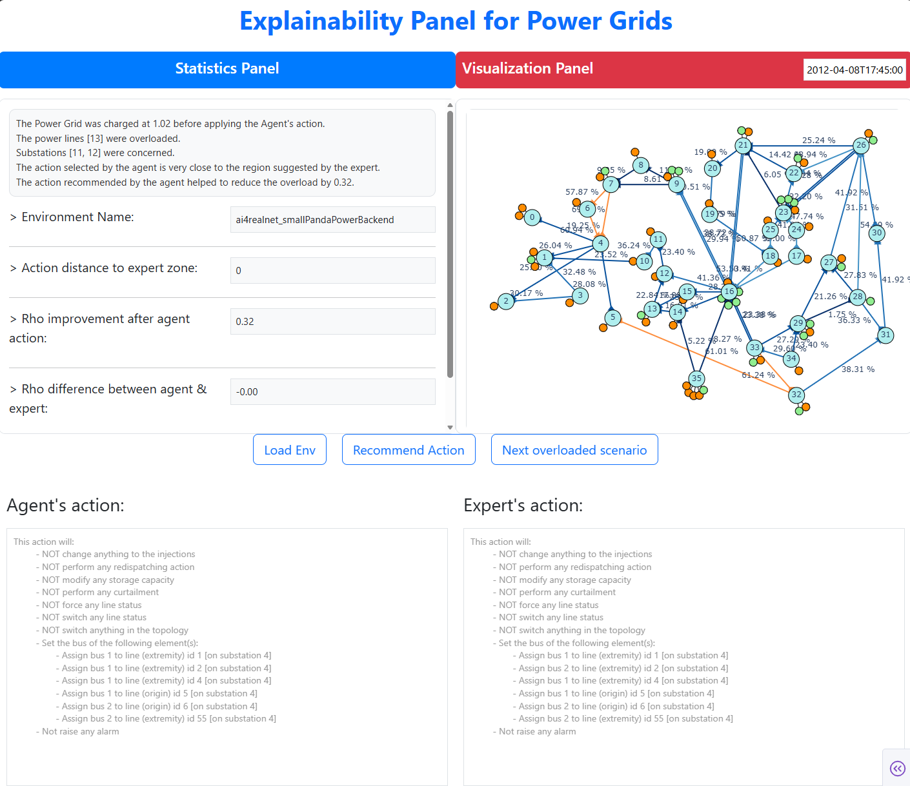

# T2.3_explainability_dashboard
This repository provides an explainability panel for RL agents developed for Power Grid use case. It is related to Task 2.3 of AI4REALNET project.


# Installation guide
To be able to run the experiments in this repository, the following steps show how to install this package and its dependencies from source.

### Setup a Virtualenv (optional)
#### Create an environment using `Conda` (recommended)
```bash
conda create -n env_explainability python=3.10
conda activate env_explainability
```

#### Create a virtual environment using `virtualenv`
```bash
cd my-project-folder
pip3 install -U virtualenv
python3 -m virtualenv my_env
source my_env/bin/activate
```

### Install the prerequisites
> [!IMPORTANT] 
> These steps are mandatory to be able to use the package and its different functionalities
#### ExpertOp4Grid package
```bash
git clone git@github.com:Mleyliabadi/ExpertOp4Grid.git
cd ExpertOp4Grid
pip install -U .
```

#### LJN Agent package
```
git clone git@github.com:Mleyliabadi/l2rpn-2023-ljn-agent.git
cd l2rpn-2023-ljn-agent
pip install -U .
```

### Install the requirements for the current package
```bash
pip install -r requiremnets.txt
```

## Requirements
Two major requirements for this explainability panel are:
1. **Agent**: An already trained agent on one of the power grid environments
> [!WARNING]
> This package works only with [ExpertAgent Heuristic](https://github.com/AI4REALNET/T2.1_deep_expert) developed in the context of AI4REALNET project. It could be improved in future to be adapted to other agents.

2. **Environment**: One of the power grid environments designed for the projet. It could also be used for other environments.
> [!WARNING]
> This package works only with [`ai4realnet_small`](https://github.com/AI4REALNET/grid2op-scenario) environment designed for AI4REALNET project and that corresponds to the first usecase of Power Grids. It could be improved in future to include other environments.

3. **ExpertOp4Grid**: You should configure the ExpertOp4Grid configuration file, which is available for an example in [`explainability_panel/config_expert.ini`](explainability_panel/config_expert.ini)

## Dashboard
A screenshot of the Explainability dashboard is provided below. It composed of two main parts:
1. **Statistics Panel**: some statistics allowing to analyze in more detail the agent's action and its impacts. These statistics are:
    - The number of hops that the agent's action is distant from the expert interest zone;
    - How much the agent's action allows to reduce the maximum overload on the grid (which is expressed by $\rho$);
    - The difference between the $\rho$ values affected by the action of the actual agent and the best action proposed by the expert;
    - The Wilcoxon test with $95\%$ of confidence between the top-k agent's action distribution ranks and their corresponding ranks when using a greedy strategy. If $p-value$ is less that $0.05$, we reject the null hypothesis telling that there is no significant difference between the agent's action and best actions found using the greedy strategy. Hence, the agent's action may not be reliable.

2. **Visualization panel**: showing whether the grid or an overload graph (in the case of overload) obtained using the ExpertOp4Grid package and highlighting the highest impact zone near the overload as well as the actual agent's action. The agent recommendations will also be shown on this graph.



### Usage
You can run the dashboard by simply executing the following command:
```bash
cd explainability_panel
python explainability.py
```

For the moment, an agent is hard coded inside the code. Future developments will allow the user to import a custom agent from the interface and analyze its recommendations.

There are three buttons:
1. ``Load Env``: Load (reset) the environment and load the agent.
2. `Next scenario`: One step of the environment.
3. `Recommend Action`: Recommend an action from the considered agent.

Two addtional zones:
- **Explanation**: A text interpreting the statistics shown in the left side of the panel. 
- **Action description**: prints the action remmended by the Agent.

## License information
This Source Code is subject to the terms of the Mozilla Public License (MPL) v2 also available [here](LICENSE)